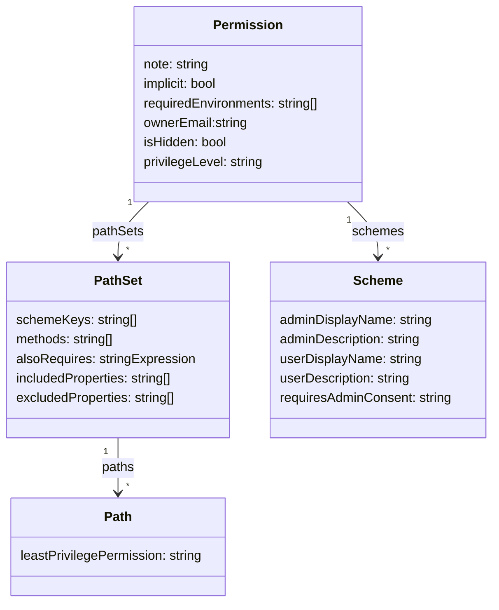

# Permissions for HTTP APIs 

## Abstract
This document defines a "permission" object and "permissions" document that describes identifiers that can be used by security claims to grant access to HTTP resources.

## Introduction
Protecting data in HTTP APIs from unauthorized access is critical. One technique to do this is by associating permissions with resources and requiring API callers to present a bearer token that can prove what permissions have been consented to the caller. This document describes a JSON based document format that can store the relationships between permission and resource.

In this design, the permission is the primary concept and the resources that are controlled are associated to the permission. The relationship is many-to-many and so could be modelled in an inverted way with resources being assigned the permissions. However, the permission centric view was chosen to emphasise to the author of the permission the scope of control being assigned to the permission.  It is the opposite view to how this information will often be used in tooling. Tooling will need to invert the model to identify what permissions could be used to access a resource. The trade-off is the tooling writers will need to do more for the benefit of permission authors. Application users and administrators are increasingly asking for the ability to consent to more fine-grained permissions that are limited in the number of resources they can access via a single permission. This limits the ability of applications performing unintended or malicious actions on behalf of users. Models that present a resource centric view of permissions obscure the total scope of the permission and lead to the creation of permissions that create unnecessary risk.   

The relationship between a permission and the resources it controls have a number of attributes including the HTTP method being granted, the type of security scheme being used, and properties of the resource being protected.  Ideally these relationships would be consistent for all resources controlled by a permission.  However, in reality that is not always the case. This model enables modelling the paths as sets of paths that do behave consistently and a permission can have multiple sets of paths. This approach minimizes the duplication of relationship attributes and encourages consistency in relationship design due to the overhead of managing distinct path sets. 

## Notational Conventions
The key words "MUST", "MUST NOT", "REQUIRED", "SHALL", "SHALL NOT", "SHOULD", "SHOULD NOT", "RECOMMENDED", "NOT RECOMMENDED", "MAY", and "OPTIONAL" in this document are to be interpreted as described in BCP 14 [RFC2119] [RFC8174] when, and only when, they appear in all capitals, as shown here.

## <a name="permissionsObject"></a> Permissions JSON Object
The canonical model for a permissions document is a JSON [JSON] object. When serialized in a JSON document, that format is identified with the "application/permissions+json" media type.

```json
{
	"permissions": {
		"PrintSettings.Read.All": {
			"schemes": {
				"DelegatedWork": {
					"userConsentDisplayName": "Read print settings",
					"userConsentDescription": "Allow signed in user to read print settings"
				}
			},
			"pathSets": [{
				"schemes": ["DelegatedWork"],
				"methods": ["GET"],
				"paths": {
					"/print/settings": {}
				}
			}]
		}
	}
}
```

In this example, the claim "PrintSettings.Read.All" is required when using the "DelegatedWork" security scheme to access the resource "/print/settings" using the "GET" method.

### permissions
The "permissions" member is a JSON object whose members permission objects. The key of each member is the claim identifier used for the [Permission Object](#permissionObject)    


## <a name="permissionObject"></a>Permission Object

The permissions object contains the details about a permission that can be used as claim in a API security token.

### note
The "note" member is a freeform string that provides additional details at about the permission that cannot be determined from the other members of the permission object.

### implicit
The "implicit" member is a boolean value that indicates that the current permission object is implied.  The default value is "false". This member us usually set to "true" in combination with a "alsoRequires" expression.

> Note: This member enables support for legacy paths that have been created that do not require any permission. Also, when used in combination with the "alsoRequires" member it enables support for the Microsoft Graph "create subscription" endpoint and the "Search query" endpoint. 

### schemes
The "schemes" member is a REQUIRED JSON object whose members are [Scheme objects](#schemeObject) supported by the permission. The key of each member is an identifier of the scheme and the value is a [Scheme object](#schemeObject) that contains descriptions of the permission within the scheme.   

### pathSets
The "pathSets" member is a REQUIRED JSON Array. Each element of the array is a [pathSet object](#pathSetObject). 

### privilegeLevel
The "privilegeLevel" member value provides a hint as to the risks of consenting this permissions. Valid values include: low, medium and high.

## <a name="provisioningInfo"></a>Provisioning Info Object

The provisioning info object contains information related to the deployment of the permission into its environment. This object should only contain information that is not required by a consumer of the API and can safely be removed in any public projection of the permissions information.

### isHidden
The "isHidden" member is a boolean value that indicates if a permission should be publicly usable in the API.  

### requiredEnvironments
The "requiredEnvironments" member is an array of strings that identifies the deployment environments in which the permission SHOULD be supported. When this member is not present, support for all environments is implied.

### resourceAppId
The "resourceAppId" member value provides an identifier of the resource server that is used to enforce Conditional Access checks for this permission.

### ownerSecurityGroup
The "ownerSecurityGroup" member is a REQUIRED string that provides a contact mechanism for communicating with the owners of the permission. It is important that owners of permissions are aware when new paths are added to an existing permission.

## <a name="pathSetObject"></a>PathSet Object
A pathSet object identifies a set of paths that are accessible have a common set of security characteristics, such as HTTP methods and schemes. Ideally, a permission object contains a single pathSet object. This indicates that all paths protected by the permission support the same characteristics. In practice there are cases where support is not uniform. Distinct pathSet objects can be created to separate the paths with varying characteristics.  

> Note: The design chosen was intentional to encourage permission creators to ensure support for methods and schemes is as consistent as possible. This produces a better developer experience for API consumers.

```json
"pathSets": [{
        "schemeKeys": ["DelegatedWork"],
        "methods": ["GET"],
        "paths": {
            "/print/settings": {}
        }
    },
    {
        "schemeKeys": ["Application"],
        "methods": ["GET,POST"],
        "paths": {
            "/print/settings": {}
        }
    }
] 
```

### schemeKeys
The "schemeKeys" member is a REQUIRED array of strings that reference the schemes defined in the [permission object](#permissionObject) that are supported by the paths in this pathSet object. Each value in this array MUST match one of the keys of the "schemes" member in the [permission object](#permissionObject).

### methods
The "methods" member is a REQUIRED array of strings that represent the HTTP methods supported by the paths in this pathSet object.

### paths
The "paths" member is a REQUIRED object whose keys contain a simplified URI template to identify the resources protected by this permission object.

### alsoRequires
The "alsoRequires" member is logical expression of permissions that must be presented as claims alongside the current permission. 

```
(User.Read | User.Read.All) & Group.Read
```

### includedProperties
The "includedProperties" member is an array of strings that identify properties of the resource representation returned by the path, that are accessible with the permission.

### excludedProperties
The "includedProperties" member is an array of strings that identify properties of the resource representation returned by the path, that are not accessible with the permission.


## <a name="schemeObject"></a>Scheme Object
The scheme object has members that describe the permission within the context of the scheme. Additional members provide behavioral constraints of the permission when used with the scheme.  

```json
"schemes": {
    "DelegatedWork": {
        "adminDisplayName": "Read and write app activity to users'activity feed",
        "adminDescription": "Allows the app to read and report the signed-in user's activity in the app.",
        "userConsentDisplayName": "Read and write app activity to users'activity feed",
        "userConsentDescription": "Allows the app to read and report the signed-in user's activity in the app.",
        "requiresAdminConsent": true
    },
    "DelegatedPersonal": {
        "userConsentDisplayName": "Read and write app activity to users'activity feed",
        "userConsentDescription": "Allows the app to read and report the signed-in user's activity in the app."
    },
    "Application": {
        "adminDisplayName": "Read and write app activity to users' activity feed",
        "adminDescription": "Allows the app to read and report the signed-in user's activity in the app.",
    }
```

### adminDisplayName
The "adminDisplayName" member is a string that provides a short permission name that considers the current scheme and the perspective of a resource administrator.

### adminDescription
The "adminDescription" member is a string that describes the permission considering the current scheme from the perspective of a resource administrator.

### userConsentDisplayName
The "userConsentDisplayName" member is a REQUIRED string that provides a short permission name that considers the current scheme and the perspective of the user consenting an application.

### userConsentDescription
The "userConsentDescription" member is a REQUIRED string that describes the permission considering the current scheme from the perspective of the user consenting an application.

### requiresAdminConsent
The "requiresAdminConsent" member is a boolean value with a default value of false. When true, this permission can only be consented by an adminstrator.

## <a name="pathObject"></a>Path Object
The path object contains properties that affect how the permission object controls access to resource identified by the key of the path object.

```json
"paths": {
  "/me/activities/{id}": {
    "leastPrivilegePermission": ["DelegatedWork", "DelegatedPersonal"]
  }
```

### leastPrivilegePermission
The "leastPrivilegePermission" member is an array of strings that identify the schemes for which the current permission is the least privilege permission for accessing the path. Each string value in the array MUST match one of the schemes defined in the [pathSet Object](#pathsetObject) 

## Appendix A. Model Diagram



## Appendix B. JSON Schema for HTTP Problem 
```json
{
    "$schema": "http://json-schema.org/draft-07/schema",
    "title": "Schema for OAuth Permissions",
    "type": "object",
    "properties": {
        "additionalProperties": false,
        "permissions": {
            "title": "Map of permission name to definition",
            "additionalProperties": false,
            "type": "object",
            "patternProperties": {
                "[\\w]+\\.[\\w]+[\\.[\\w]+]?": {
                    "$ref": "#/definitions/permission"
                }
                }
            }
        }
    },
    "definitions": {
        "permission": {
            "type": "object",
            "title": "Permission definition",
            "additionalProperties": false,
            "properties": {
                "note": {"type": "string"},
                "implicit": {"type": "boolean"},
                "isHidden": {"type": "boolean"},
                "ownerEmail": {"type": "string"},
                "privilegeLevel": {
                    "type":"string",
                    "enum":["low","medium","high"]
                }
                "requiredEnvironments": {
                    "type": "array",
                    "items": {
                        "type": "string"
                    }
                },
                "alsoRequires": {
                    "type": "string",
                    "pattern": "[\\w]+\\.[\\w]+[\\.[\\w]+]?"
                },
                "schemes": {
                    "type": "object",
                    "patternProperties": {
                        ".*": {
                            "$ref": "#/definitions/scheme"
                            }
                        }
                    }
                },
                "pathSets": {
                    "type": "array",
                    "items": {
                        "$ref": "#/definitions/pathSet"
                        } 
                    }
                }
            },
        "pathSet": {
            "type": "object",
            "additionalProperties": false,
            "properties": {
                "schemeKeys": {
                    "type": "array",
                    "items": {
                        "type": "string"
                    }
                },
                "methods": {
                    "type": "array",
                    "items": {
                        "type": "string",
                        "enum": ["GET","PUT","POST","DELETE","PATCH","HEAD","OPTIONS","<WriteMethods>","<ReadMethods>"
                        ]
                    }
                },
                "paths": {
                    "type": "object",
                    "patternProperties": {
                        ".*": {
                            "$ref": "#/definitions/path"
                           }
                        }
                    }
                },
                "includeProperties": {
                    "type": "array",
                    "items": {
                        "type": "string"
                    }
                },
                "excludeProperties": {
                    "type": "array",
                    "items": {
                        "type": "string"
                    }
                }
        },
        "path": {
            "type": "object",
            "properties": {
                "leastPrivilegePermission": {
                    "type": "array",
                    "items": { "type":"string"}
                }
            },
        "scheme": {
            "type": "object",
            "properties": {
                "requiresAdminConsent": {
                    "type": "boolean"
                },
                "adminDisplayName": {
                    "type": "string"
                },
                "adminDescription": {
                    "type": "string"
                },
                "userConsentDisplayName": {
                    "type": "string"
                },
                "userConsentDescription": {
                    "type": "string"
                }
            }
    }
}
```